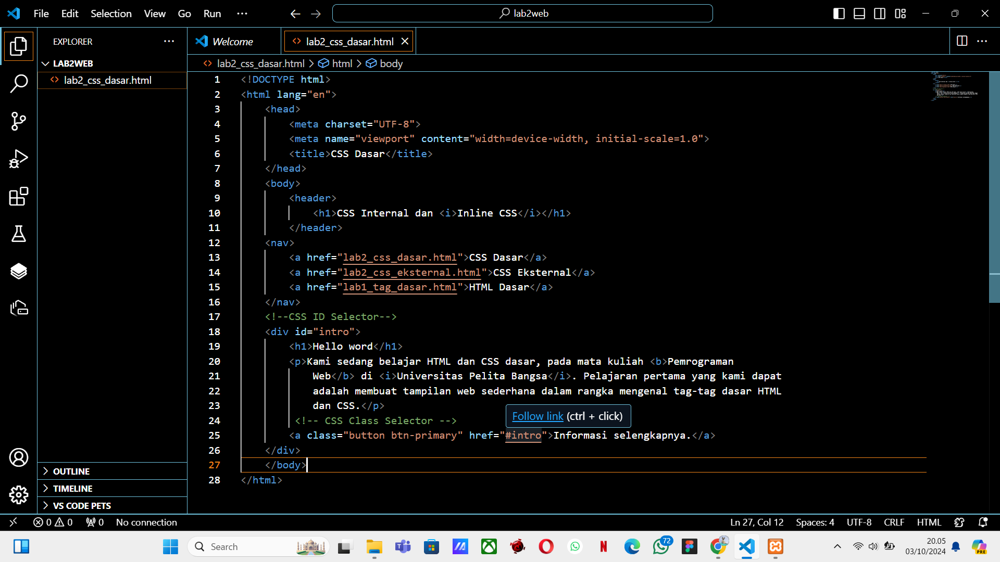

# Lab2Web
## Nama : Pamuji raharjo
## NIM  : 312310720
## kelas :TI 23 A.4
## 1. Membuat file baru praktikum2,menambahkan tag CSS dasar,dan membuat dokumen HTML.
- Gambar1

- Gambar2

## 2. Kemudian membuat style css
- Gambar result

## 3. Kemudian atur atribut paragraf dan menambahkan sub judul
- Gambar 1

- Gambar result 1

## 4. Format teks pada paragraf tersebut
- Gambar result

## 5. Kemudian menyisipkan gambar kepada halaman web dan menambahkan judul
- Gambar 1

- Gambar 2

- Gambar Result 1&2

## 6 Menambahkan Hyperlink pada dokumen tersebut
- Gambar 1

- Final Result

